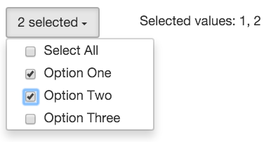

[](https://travis-ci.org/icanjs/multi-select)
[](https://badge.fury.io/js/multi-select)
[](https://gitter.im/icanjs/multi-select?utm_source=badge&utm_medium=badge&utm_campaign=pr-badge&utm_content=badge)

# A multi-select component for CanJS

[](https://nodei.co/npm/multi-select/)

## Demo

Here is a [JSBin](http://jsbin.com/fevoje/edit?js,output) demo.



## Installation
```
npm install multi-select --save
```

You can use any of the builds in the dist folder to meet your project needs.

## Usage

Using CanJS's built-in support for StealJS, you can now import the module directly inside your templates.  For example:
```html
<can-import from="multi-select"/>

<multi-select select-all>
  <option value="1">One</option>
  <option value="2" selected>Two</option>
  <option value="3" disabled>Three</option>
</multi-select>

<multi-select select-all="default" selected-values="{selectedValues}">
  {{#each items}}
    <option value="{{value}}" {{#if isSelected}}selected{{/if}}>{{text}}</option>
  {{/each}}
</multi-select>

<multi-select list="{items}" selected-items="{selectedItems}"></multi-select>

<multi-select list="{items}"
              value-prop="id"
              text-prop="name"
              selected-prop="isChecked"
              selected-items="{selectedItems}"
              select-all></multi-select>

<multi-select select-all
              all-selected-value="-1"
              {^selected-values}="selectedValues"
              {^are-all-selected}="areAllSelected">
  <option value="-1">All</option>
  <option value="1">One</option>
  <option value="2">Two</option>
  <option value="3" selected>Three</option>
</multi-select>
```
With all-selected-value the _selectedValues_ will result in _[-1]_.

### Event delegation:
```html
<multi-select {list}="items" (itemclick)="onItemClick"></multi-select>

<multi-select {list}="items" click-event-name="myevent" (myevent)="onItemClick"></multi-select>

var onItemClick = function(context, el, ev, params){
    console.log('Item was clicked with value=%s and isSelected=%s ', params.value, params.isSelected);
}
```

For can-2.2.x and older there will be an additional event triggered on the element and can be captured like this on the parent component with events:
```javascript
events: {
    'multi-select itemclick': function(context, ev, params){
        console.log('Item was clicked!', params);
        // -> {value: 5, isSelected: true, selectedValues: [5,6,7]}
    }
}

```


## API

- **list**: a list of items to use if no <option> tags are rendered inside the component.
- **selected**: an array of _selected items_ as objects with _value and text_ properties.
- **selected-values**: an array of _selected values_.
- **selected-items**: an array of selected items if items are passed as _list_.
- **are-all-selected**: boolean, true if all options are selected.
- **(itemclick)**: the handler will be called with 4 arguments by default:
 - content,
 - element,
 - ev,
 - params: {value: \<itemValue\>, isSelected: \<boolean\>, selectedValues: \<array of selected values\>}


### Options:

- **select-all**: show "Select All" option. If value "default" is passed then all options will be preselected. Default: false.
- **select-all-text**: string to be shown for "Select All" option. Default: 'Select All'.
- **all-selected-text**: string to be shown when all items are selected. Default: 'All Selected'.
- **all-selected-value**: a value to be returned when all options are selected (e.g. if its -1, then selectedValues will result in [-1]).
- **value-prop**: property name to look up for value. Default: 'value'
- **text-prop**: property name to look up for text. Default: 'text'.
- **selected-prop**: property name to look up to check if an item should be selected. Default: 'isSelected'.
- **disabled-prop**: property name to look up to check if an item should be disabled. Default: 'isDisabled'.
- **click-event-name**: property name to look up to check if an item should be disabled. Default: 'itemclick'.


## Contributing
Pull requests are welcome.

## Authors

- [Marshall Thompson](https://github.com/marshallswain)
- [Ilya Fadeev](https://github.com/ilyavf)

[](http://StealJS.com)

